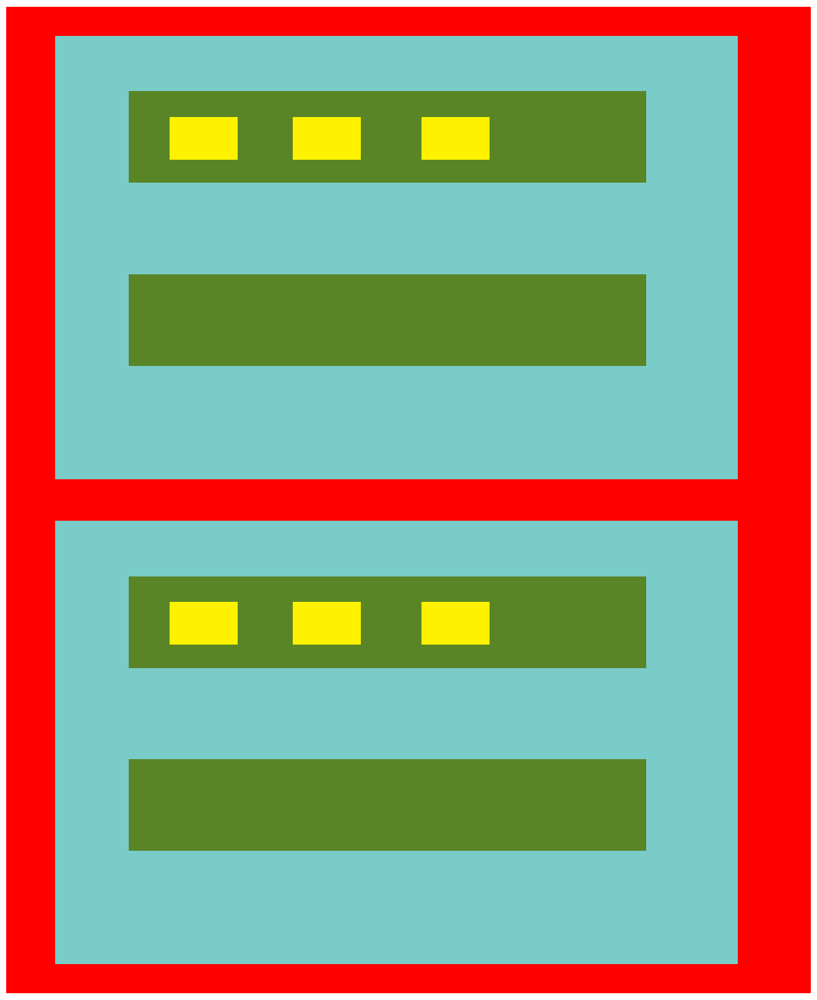

### Communication parent -> child and child -> parent

Remember the structure of components provided as per the example

Run the project via `npm start` or `yarn start` depending on your local config